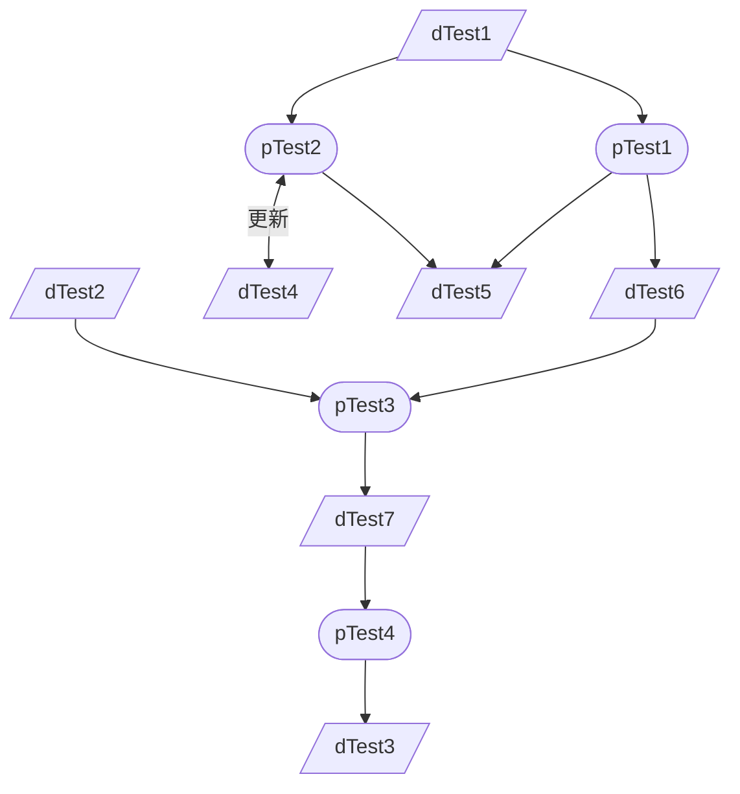

- [1. P01 test](#1-p01-test)
  - [1.1. 目的](#11-目的)
  - [1.2. 関係青果物](#12-関係青果物)
    - [1.2.1. 入力青果物](#121-入力青果物)
    - [1.2.2. 出力青果物](#122-出力青果物)
    - [1.2.3. 更新青果物](#123-更新青果物)
  - [1.3. PFD](#13-pfd)

# 1. P01 test

## 1.1. 目的

- ＊＊＊＊＊＊を目的とする

## 1.2. 関係青果物

### 1.2.1. 入力青果物

- D01_dTest1
- D02_dTest2

### 1.2.2. 出力青果物

- D03_dTest3

### 1.2.3. 更新青果物

- D04_dTest4

## 1.3. PFD

[このプロジェクトへのコントリビューションガイドライン](/D01_dTest1.md)

